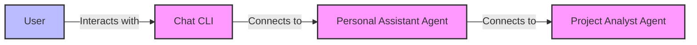
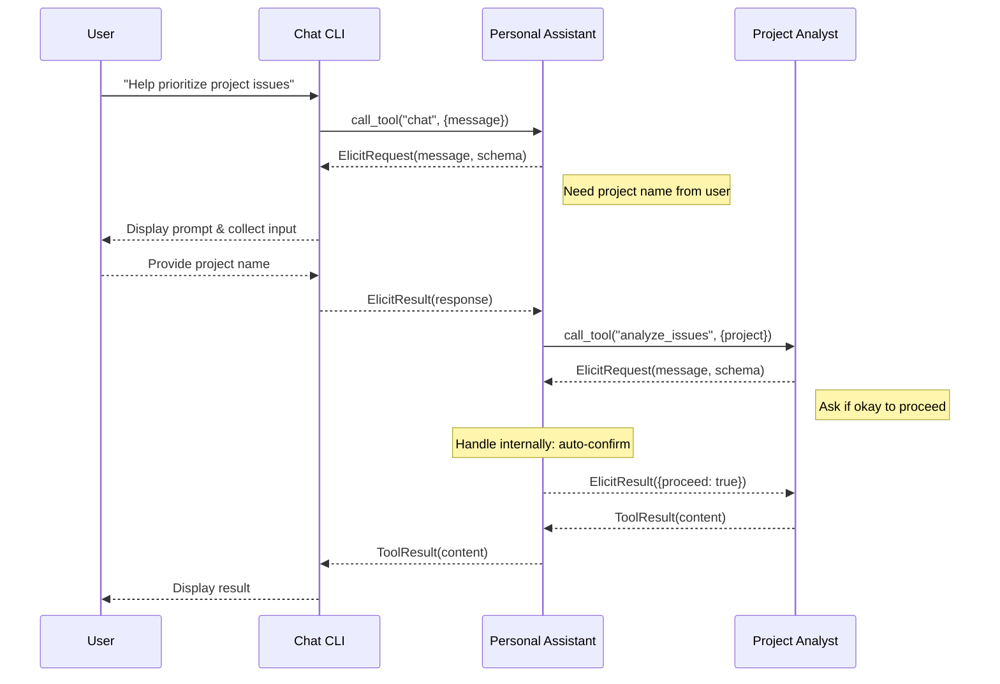

# MCP Agents Example

This example demonstrates an agent-based architecture using MCP (Model Context Protocol). The example consists of three components:

1. **Project Analyst Agent** - An MCP server that provides tools for analyzing project issues and priorities
2. **Personal Assistant Agent** - An MCP server that acts as a client to other agents while providing its own tools
3. **Chat CLI** - A command-line interface that connects to the Personal Assistant agent

## Architecture

This example demonstrates a layered architecture of MCP agents where each component can act as both a client and a server.



### Elicitation Flow

When a tool needs additional information from the user, the elicitation request flows through the chain:



## Installation and Usage

```bash
uv pip install -e .
cd examples/agents/chat-cli
uv run mcp-chat-cli --log-level=DEBUG
```

This will start the entire agent chain. The Chat CLI will launch the Personal Assistant, which will in turn launch the Project Analyst.

## Example Conversation

```
You: Prioritize work on my project
2025-05-06 13:39:41,672 - INFO - Processing request of type CallToolRequest

[Agent is asking]: Which project would you like information about?
Please provide the requested information:
project_name: PythonSDK
issue_count (number): 100
2025-05-06 13:39:47,540 - INFO - Processing request of type CallToolRequest
2025-05-06 13:39:47,544 - INFO - Received elicitation request: 100 issues found. Would you like to proceed?
2025-05-06 13:39:47,545 - INFO - Elicitation response: {'proceed': True}

Assistant: Here's my analysis of project 'PythonSDK':

# Project Issues Analysis for PythonSDK

## Summary
- Total issues analyzed: 100
- Open issues: 69
- Closed issues: 31

## Issues by Priority
- medium: 37
- high: 30
- low: 17
- critical: 16

## Issues by Type
- improvement: 24
- feature: 20
- documentation: 14
- task: 21
- bug: 21

## Top Open Issues
- #1: Improvement for PythonSDK component 5 (Priority: medium)
- #2: Feature for PythonSDK component 5 (Priority: high)
- #3: Documentation for PythonSDK component 2 (Priority: high)
- #4: Task for PythonSDK component 1 (Priority: medium)
- #5: Improvement for PythonSDK component 5 (Priority: high)

## Recommended Next Steps
1. Address high priority issues first
2. Review issues with dependencies
3. Re-estimate effort for any issues that have been open for a long time

You: 
```

## Features Demonstrated

This example demonstrates several key MCP features:

1. **Elicitation** - Agents can request information from users (or other agents) during tool execution
2. **Progress Reporting** - Agents can report progress during long-running operations
3. **Layered Architecture** - Agents can be both MCP servers and clients
4. **Tool Delegation** - Agents can delegate tasks to other specialized agents
5. **Agent Communication over Elicitation** - Agents can delegate tasks to other specialized agents

## Implementation Details

Each component is implemented using Python with the MCP SDK:

- **Project Analyst Agent**: Implements a tool that analyzes project issues and can request specific details through elicitation
- **Personal Assistant Agent**: Acts as both a client (to the Project Analyst) and a server (to the Chat CLI)
- **Chat CLI**: Provides a simple text interface and handles elicitation requests by prompting the user

All communication happens using the MCP protocol over stdio transport, demonstrating how agents can be composed into more complex systems.