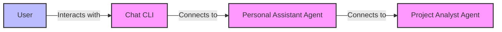
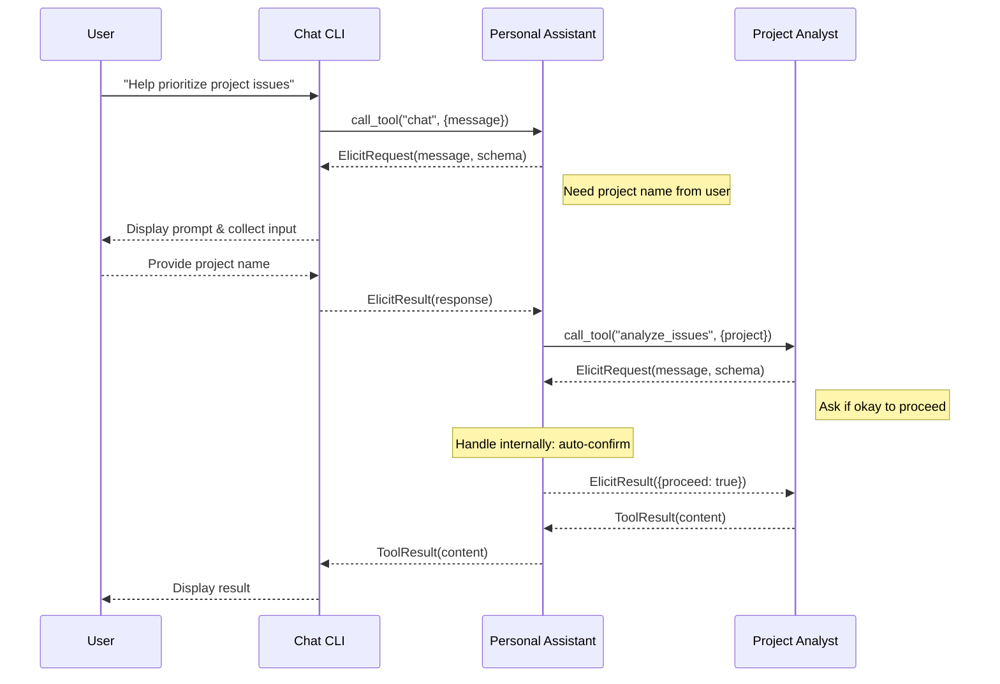

# MCP Agents Example

This example demonstrates an agent-based architecture using MCP (Model Context Protocol). The example consists of three components:

1. **Project Analyst Agent** - An MCP server that provides tools for analyzing project issues and priorities
2. **Personal Assistant Agent** - An MCP server that acts as a client to other agents while providing its own tools
3. **Chat CLI** - A command-line interface that connects to the Personal Assistant agent

## Architecture

This example demonstrates a layered architecture of MCP agents where each component can act as both a client and a server.



### Elicitation Flow

When a tool needs additional information from the user, the elicitation request flows through the chain:



## Installation and Usage

### 1. Set up the Project Analyst Agent

```bash
# From the project-analyst directory
cd project-analyst
uv venv .venv
source .venv/bin/activate  # On Windows: .venv\Scripts\activate
uv add --dev -e .
# No need to run it directly - it will be started by the Personal Assistant
```

### 2. Set up the Personal Assistant Agent

```bash
# From the personal-assistant directory
cd personal-assistant
uv venv .venv
source .venv/bin/activate  # On Windows: .venv\Scripts\activate
uv add --dev -e .
# No need to run it directly - it will be started by the Chat CLI
```

### 3. Run the Chat CLI

```bash
# From the chat-cli directory
cd chat-cli
uv venv .venv
source .venv/bin/activate  # On Windows: .venv\Scripts\activate
uv add --dev -e .
uv run mcp-chat-cli
```

This will start the entire agent chain. The Chat CLI will launch the Personal Assistant, which will in turn launch the Project Analyst.

## Example Conversation

```
You: Hello
Assistant: Hello! I'm your personal assistant. How can I help you today?

You: What can you do?
Assistant: I can help you with various tasks:
1. Analyze projects and their issues (try: "Analyze the issues for the Python SDK project")
2. Review priorities for projects
3. Provide information and assistance
4. Answer questions

What would you like help with?

You: Analyze the Python SDK project
Assistant: Here's my analysis of project 'Python':

# Project Issues Analysis for Python

## Summary
- Total issues analyzed: 5
- Open issues: 4
- Closed issues: 1

## Issues by Priority
- high: 2
- medium: 2
- low: 1

## Issues by Type
- bug: 2
- feature: 1
- improvement: 1
- task: 1

## Top Open Issues
- #1: Bug for Python component 3 (Priority: high)
- #2: Feature for Python component 2 (Priority: medium)
- #3: Improvement for Python component 1 (Priority: high)
- #5: Task for Python component 4 (Priority: low)

## Recommended Next Steps
1. Address high priority issues first
2. Review issues with dependencies
3. Re-estimate effort for any issues that have been open for a long time
```

## Features Demonstrated

This example demonstrates several key MCP features:

1. **Elicitation** - Agents can request information from users (or other agents) during tool execution
2. **Progress Reporting** - Agents can report progress during long-running operations
3. **Layered Architecture** - Agents can be both MCP servers and clients
4. **Tool Delegation** - Agents can delegate tasks to other specialized agents

## Implementation Details

Each component is implemented using Python with the MCP SDK:

- **Project Analyst Agent**: Implements a tool that analyzes project issues and can request specific details through elicitation
- **Personal Assistant Agent**: Acts as both a client (to the Project Analyst) and a server (to the Chat CLI)
- **Chat CLI**: Provides a simple text interface and handles elicitation requests by prompting the user

All communication happens using the MCP protocol over stdio transport, demonstrating how agents can be composed into more complex systems.